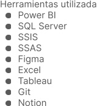

  

# Educacion  

GradoADE Especializacion en finanzas FPIl Comercio internacional  

# Certificaciones  

PowerBldataanalyst Examen PL-300  

Data analyst CoderHouse  

Contacto +34 675 688 410 nano_carp@hotmail.com  

Santander,Cantabria marianogarciam  

MARIANO-89 [diomas  

Espanol Nativo Ingles B2  

# Mariano Garcia Mortigliengo  

# Developer BI  

# Experiencia  

# Datua SA  

Developer Bl 2022 - actual.  

  

# Decathlon SA  

Reporting financiero 2020 - 2022 Herramientas utilizadas:  

Looker studio   
Excel   
Google sheet   
●JD Edwards (Oracle)   
●Qlik view (solo repositorio)  

# Proyectos  

Empresa publica de vivienda,cuadro de mando de cada una de las areas con indicadores personalizados  

Estudio de cuota mercado, cifra de venta, margen y reductores de margen.  